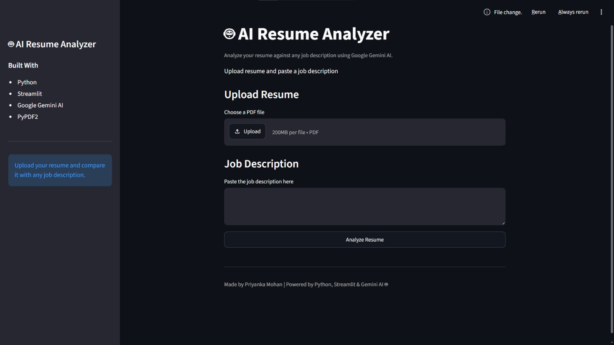
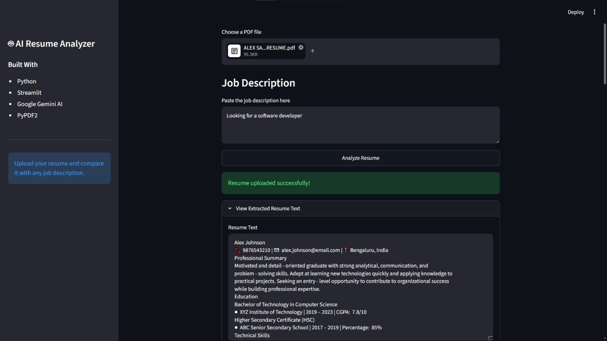
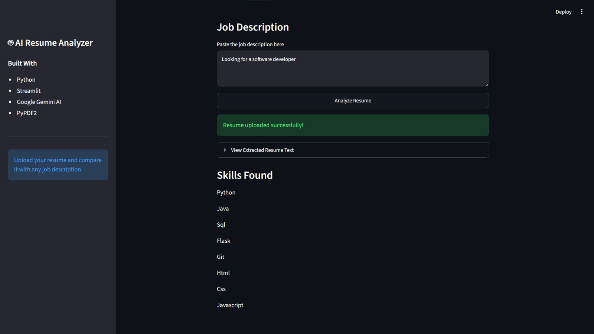
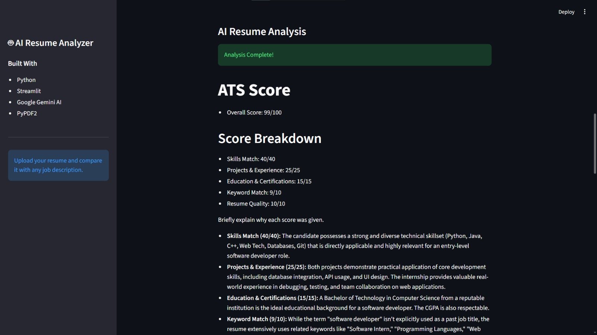
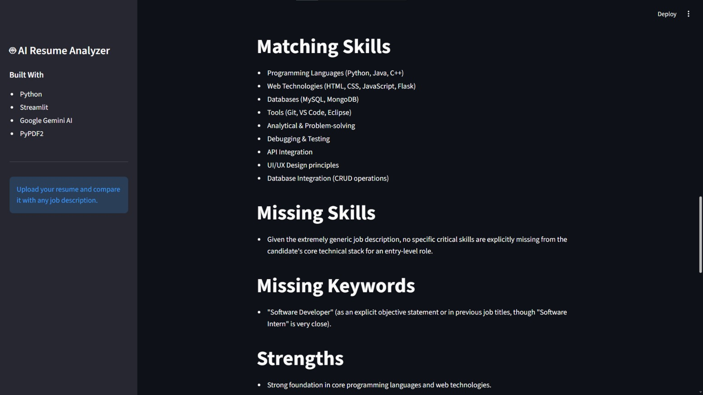
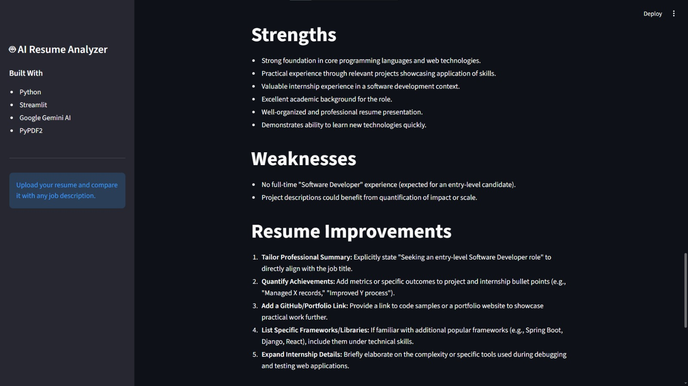
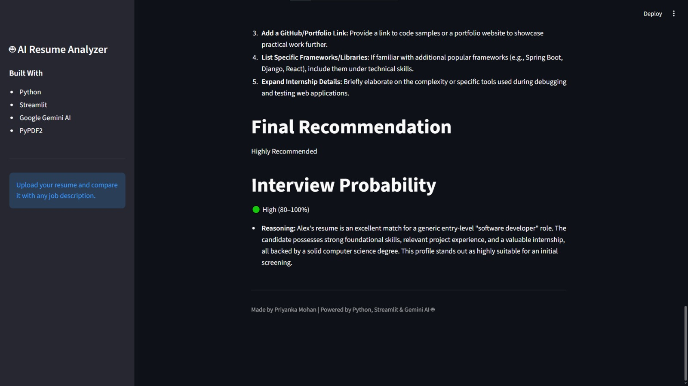

# 🤖 AI Resume Analyzer

An AI-powered Resume Analyzer built with **Python**, **Streamlit**, and **Google Gemini AI**. This application helps users evaluate their resumes against a job description by extracting resume content, identifying technical skills, and generating an ATS-style analysis with AI.

---

## 📌 Features

- 📄 Upload resume in PDF format
- 🔍 Extract text from resumes
- 💡 Detect technical skills automatically
- 🤖 Analyze resume using Google Gemini AI
- 📊 Compare resume with a job description
- 📈 Generate ATS-style feedback
- ✅ Suggest missing skills and improvements

---

## 🛠 Tech Stack

- Python
- Streamlit
- Google Gemini AI
- PyPDF2
- VS Code
- Git & GitHub

---

## 📂 Project Structure

```
AI-Resume-Analyzer/
│
├── app.py
├── README.md
├── .gitignore
├── .env
├── uploads/
│
└── utils/
    ├── gemini_analyzer.py
    ├── pdf_reader.py
    ├── resume_utils.py
    └── skills.py
```

---

## 🚀 Installation

Clone the repository:

```bash
git clone https://github.com/codie-max/AI-Resume-Analyzer.git
```

Go to the project folder:

```bash
cd AI-Resume-Analyzer
```

Create a virtual environment:

```bash
python -m venv venv
```

Activate the virtual environment.

### Windows

```bash
venv\Scripts\activate
```

Install dependencies:

```bash
pip install -r requirements.txt
```

Run the application:

```bash
streamlit run app.py
```

---

## 📖 How to Use

1. Launch the Streamlit application.
2. Upload your resume in PDF format.
3. Paste a job description.
4. Click **Analyze Resume**.
5. View the ATS score, matching skills, missing skills, strengths, weaknesses, and AI recommendations.

---

## 📸 Application Preview

## Screenshots

### 🏠 Home Page



---

### 📄 Upload Resume



---

### 💻 Skills Found



---

### 📊 ATS Score



---

### 🤖 AI Analysis



---

### 📝 Resume Improvements



---

### 🎯 Final Recommendation



## 🔮 Future Improvements

- Support DOCX resumes
- Resume score visualization
- Skill charts
- Download analysis as PDF
- Multiple resume comparison
- Resume keyword optimization

---

## 👩‍💻 Author

**Priyanka Mohan**

GitHub: https://github.com/codie-max

---

## ⭐ If you like this project

Feel free to star this repository.